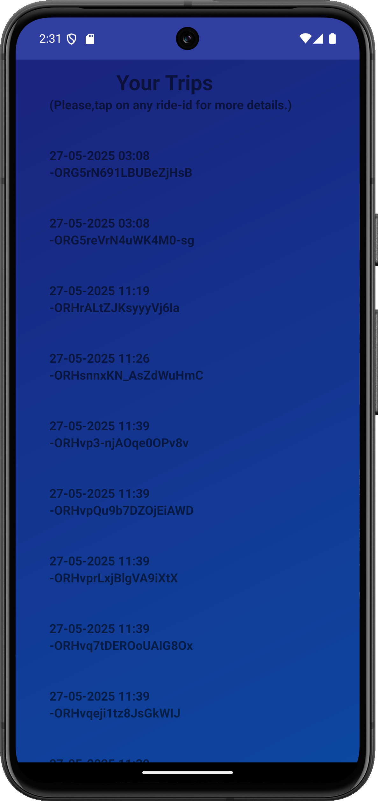
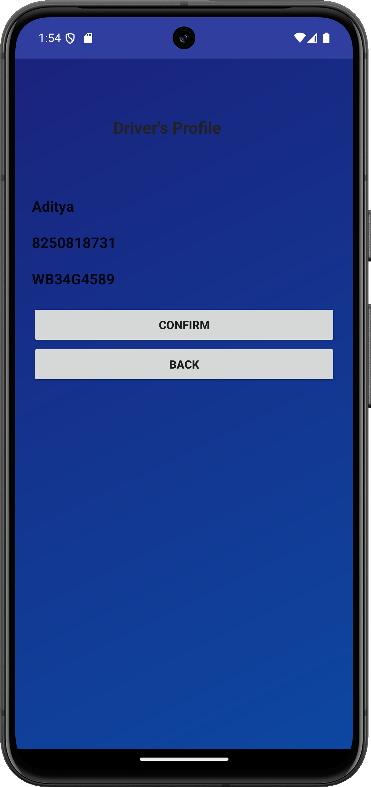
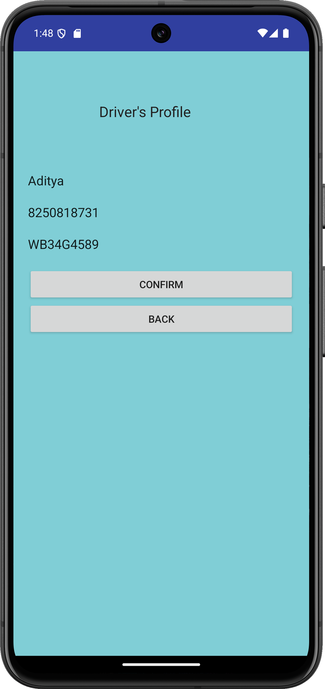
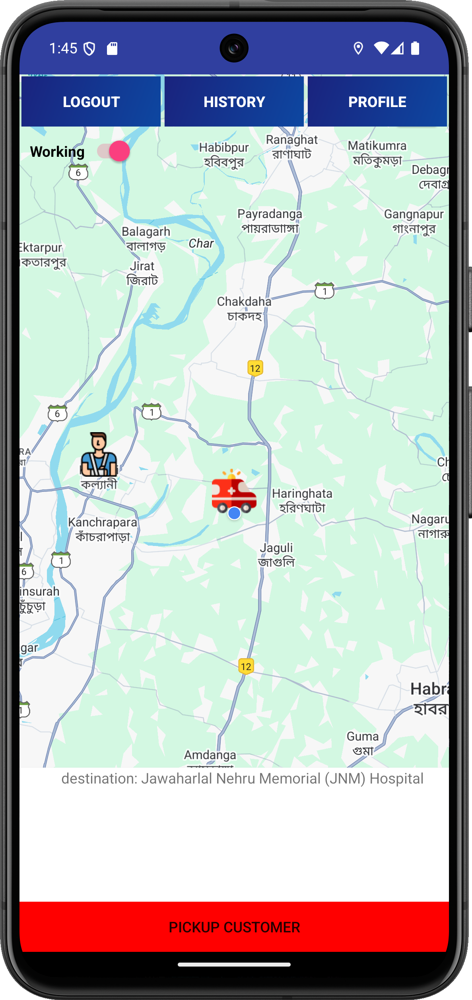
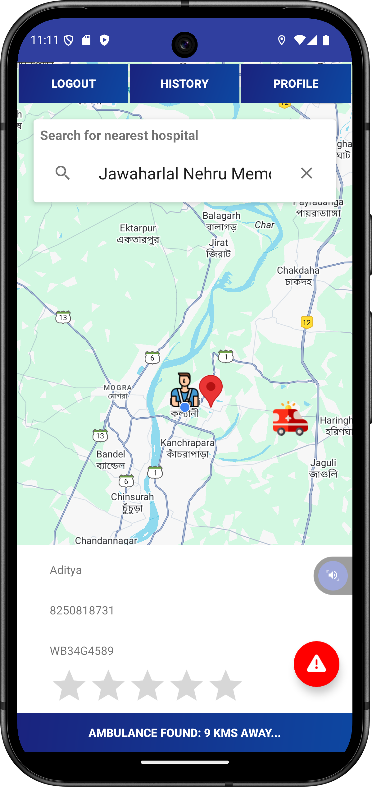
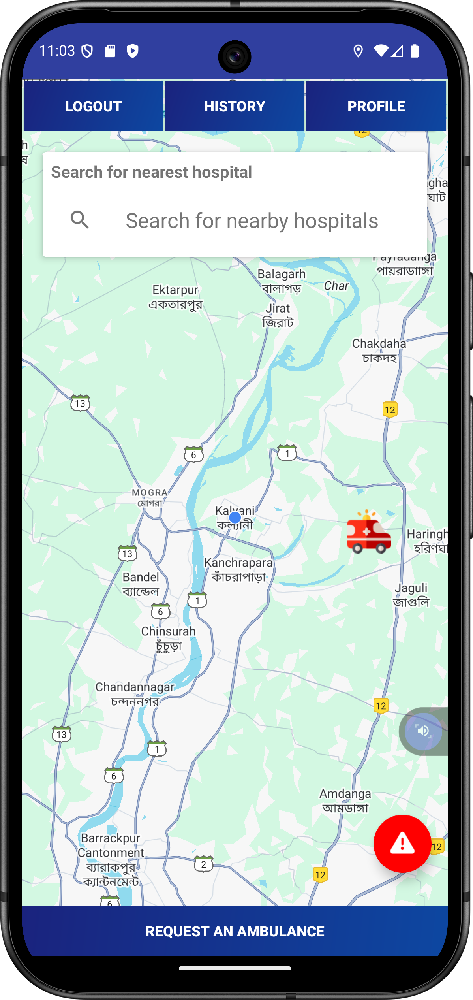
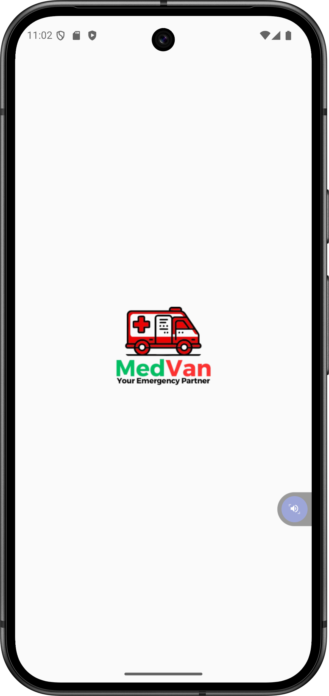
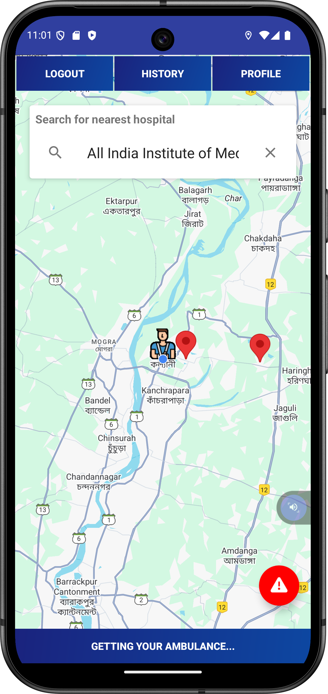
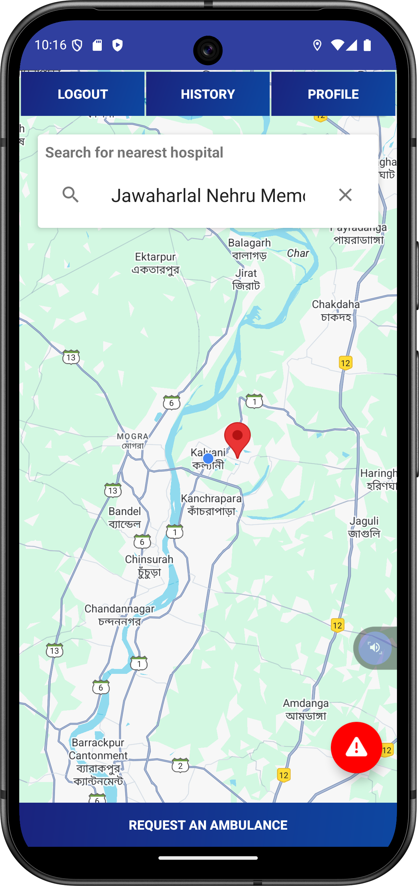
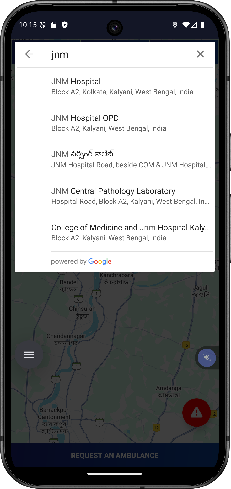

# 🚑 MedVan: Smart Ambulance Booking App  

A **real-time ambulance booking Android application** that bridges the gap between emergency patients and ambulance drivers by leveraging **location tracking**, **cloud-based communication**, and a **user-friendly interface**.

---

## 🧾 Project Overview

**MedVan** is a smart ambulance dispatching system designed and developed for Android devices. The application connects patients in need with nearby ambulance drivers in **real time**, enabling faster response during medical emergencies.

This project was developed and submitted as a part of the academic curriculum for the **Master of Computer Applications (MCA)** program at  
🎓 **Maulana Abul Kalam Azad University of Technology (MAKAUT), West Bengal**.

The application leverages **Google Maps and Firebase** to deliver a seamless experience for both users and ambulance drivers, focusing on minimizing delay and simplifying access to emergency transportation.

---

## 📱 Key Features

- 🔐 **User Authentication** (Patient & Driver)
- 🧭 **Real-time Ambulance Request** with GPS tracking
- 🚘 **Pickup Navigation & Auto-Matching for Drivers**
- 💳 **(Optional) Payment Integration**
- 📝 **Trip History & Detailed Trip Information**
- ⭐ **Ratings & Feedback System**
- 🛠️ **Report an Issue** functionality
- ⚙️ **User Settings** (separate for Patient and Driver)
- 🔄 **Forgot/Reset Password**
- 🖼️ **Clean UI with Welcome and Onboarding Screens**

---

## 🛠️ Tech Stack

| Technology         | Purpose                                 |
|--------------------|------------------------------------------|
| **Android (Java)** | Core App Development                    |
| **Android Studio** | IDE for Development                     |
| **Firebase**       | Authentication & Realtime Database      |
| **Google Maps API**| Live Tracking & Route Navigation        |
| **Places API**     | Autocomplete & Location Suggestions     |
| **Device GPS**     | Real-Time Location Detection            |
| **Min SDK**        | API Level 21 (Android 5.0 - Lollipop)   |

---

## 📸 Screenshots

> _A glimpse of the app UI and functionality:_

|  |  |
|--------------------------------------------|--------------------------------------------|
|  |  |
|  |  |
|  |  |
|  |  |
|  |  |
|  |                                            |

---

## 🧩 Database Architecture

> The app uses **Firebase Realtime Database** for structured and synchronized data communication between users and drivers.

📌 _Note: Database structure images have been removed in this version. Please refer to the Firebase console or DB schema documentation._

---

## 🚀 Getting Started

### 🔧 Prerequisites

- Android Studio (latest recommended)
- Firebase account
- Google Maps API & Places API keys

### 🛠 Installation Steps

```bash
# 1. Clone the repository
git clone https://github.com/codebysrv/MedVan.git

# 2. Open the project in Android Studio

# 3. Add Firebase configuration file
# Place your google-services.json in the 'app/' directory

# 4. Build the project and run it on an emulator or physical device


---

📚 Final Year MCA Thesis
This project was submitted in partial fulfillment of the requirements for the degree of Master of Computer Applications (MCA)
at Maulana Abul Kalam Azad University of Technology (MAKAUT), West Bengal.

📄 View Thesis (on GitHub):
📘 MedVan MCA Final Year Project Thesis

📥 Direct PDF Download:
⬇️ Click here to download the full MCA Thesis

The thesis includes system architecture, Firebase schema, implementation approach, and a detailed walkthrough of the features.

📄 License
This project is licensed under the MIT License.
See the LICENSE file for more information.

🤝 Contributing
We welcome feedback, feature suggestions, and contributions to improve this app further.
Feel free to fork, raise issues, or submit pull requests.
