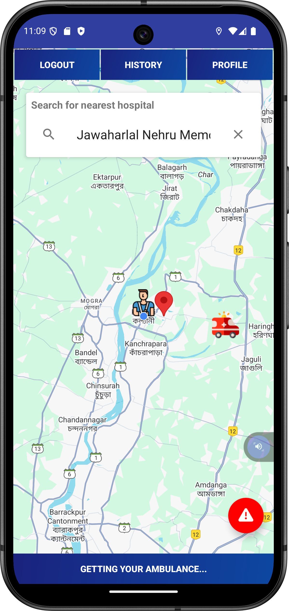

# 🚑 MedVan: Smart Ambulance Booking App  

A **real-time ambulance booking application** designed for Android that connects patients with the nearest available ambulances and drivers, ensuring **fast and reliable emergency response**.

---

## 📱 Key Features

- 🔐 **User Authentication** (Patient & Driver)
- 🧭 **Real-time Ambulance Request** with GPS tracking
- 🚘 **Pickup Navigation & Auto-Matching for Drivers**
- 💳 **(Optional) Payment Integration**
- 📝 **Trip History & Detailed Trip Information**
- ⭐ **Ratings & Feedback System**
- 🛠️ **Report an Issue** functionality
- ⚙️ **User Settings** (separate for Patient and Driver)
- 🔄 **Forgot/Reset Password**
- 🖼️ **Clean UI with Welcome and Onboarding Screens**

---

## 🛠️ Tech Stack

| Technology         | Purpose                                 |
|--------------------|------------------------------------------|
| **Android (Java)** | Core App Development                    |
| **Android Studio** | IDE for Development                     |
| **Firebase**       | Authentication & Realtime Database      |
| **Google Maps API**| Live Tracking & Route Navigation        |
| **Places API**     | Autocomplete & Location Suggestions     |
| **Device GPS**     | Real-Time Location Detection            |
| **Min SDK**        | API Level 21 (Android 5.0 - Lollipop)   |

---

## 📸 Screenshots

> _A glimpse of the app UI and functionality:_

|  |  |
|--------------------------------------------|--------------------------------------------|
|  |  |
|  |  |
|  |  |
|  |  |
|  |  |
|  |                                            |

---

## 🧩 Database Architecture

> The app uses **Firebase Realtime Database** for structured and synchronized data communication between users and drivers.

📌 _Note: Database structure images have been removed in this version. Please refer to the Firebase console or DB schema documentation._

---

## 🚀 Getting Started

### 🔧 Prerequisites

- Android Studio (latest recommended)
- Firebase account
- Google Maps API & Places API keys

### 🛠 Installation Steps

```bash
# 1. Clone the repository
git clone https://github.com/codebysrv/MedVan.git

# 2. Open the project in Android Studio

# 3. Add Firebase configuration file
# Place your google-services.json in the 'app/' directory

# 4. Build the project and run it on an emulator or physical device


---

## 📚 Final Year MCA Thesis

This project was submitted as part of the final semester MCA curriculum.

📄 **View Thesis (on GitHub)**:  
[📘 MedVan MCA Final Year Project Thesis](https://github.com/codebysrv/MedVan/blob/main/docs/MedVan_Thesis.pdf)

📥 **Direct PDF Download**:  
[⬇️ Click here to download the full MCA Thesis](https://raw.githubusercontent.com/codebysrv/MedVan/main/docs/MedVan_Thesis.pdf)

> The thesis covers system design, architecture diagrams, Firebase integration, UI flows, and implementation steps.

---
